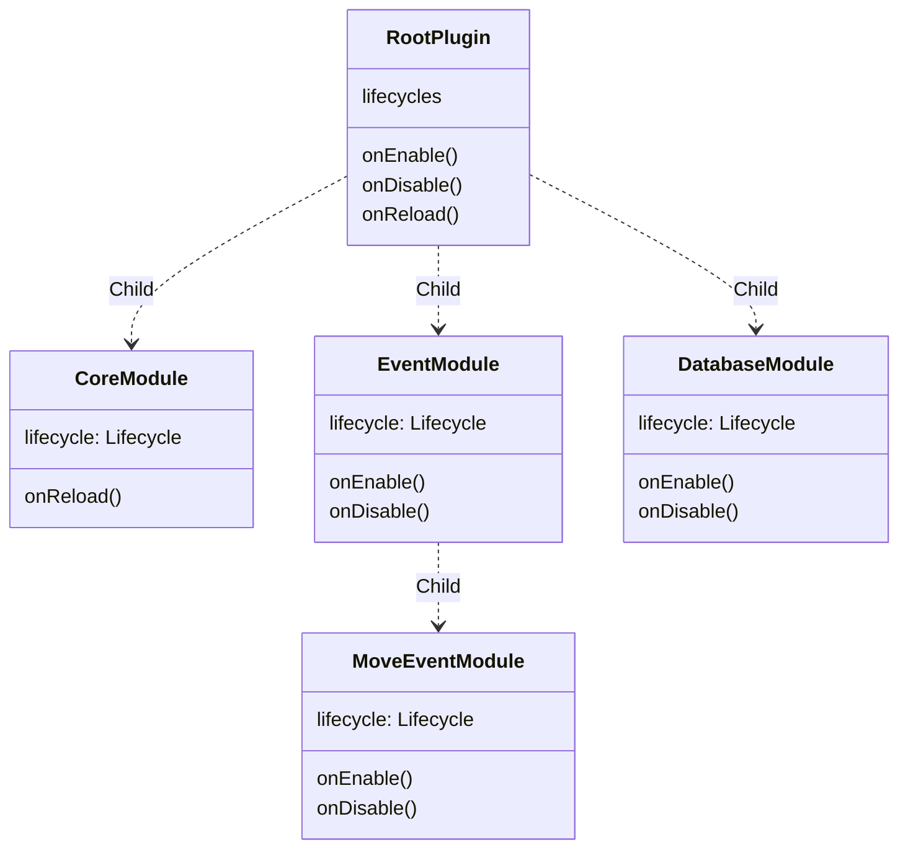

# AstraTemplate v7.0.0

### MultiPlatform (Plugin-first) Spigot/Velocity plugin

This is a Minecraft Multiplatform template that provides architecture and various tools you'll need to create new
Spigot/Velocity plugins as fast as possible

<h4 align="center">☄️ Plugins based on AstraTemplate☄️ </h4>

    
    
    
    
    

## Novice developer?

This project can be very difficult for novice developers. Especially for those who were working with java.

## Overview

AstraTemplate and it's libs design after more than 2 years of developing spigot plugins and android applications.
It contains powerful and scalable architecture template which will help you in your development.

## 1. Directory structure

    ├── modules             
    │   ├── api-local       # Local api with SQLite
    │   ├── api-remote      # Remote sample RickMorty API
    │   └── core            # Core multiplatform module
    ├── forge               # Forge template mod[wip]
    ├── fabric              # Fabric template mod[wip]
    ├── velocity            # Velocity template plugin
    └── plugin              # Bukkit template mod

## 2. Gradle plugin

Build convention is great, but it's a lot of boilerplate when you have different projects.

Because of this I've made a decision to implement my gradle plugin into AstraTemplate

My gradle plugin is well-documented and easy to use. [Please, see it](https://github.com/makeevrserg/gradle-plugin)

## 3. Modules overview

#### 3.1 `api-local`

This module contains local API with sqlite database. It contains no spigot/velocity/fabric dependencies.
Jvm only. Due to this factor, you can easily share this module between your spigot/velocity plugin or fabric/forge.

With this module you will be only dependent on LocalApi, which is an interface.

Currently AstraLibs-orm is used for SQLite api-local, but you can replace it with anything you want.
Only implementation will be changed, but LocalApi will be untouched, also as other functionality of your plugin/mod

#### 3.2 `api-remote`

This module contains remote api with RickMortyApi. It will return random character with suspend async response.
Like `api-local`, this module also contains only jvm dependencies, so can be used in spigot/fabrict and others.

#### 3.3 `dto`

Sometimes you need to share models between other modules, so this module contains shared data models.

#### 3.4 `shared`

Usually all instances(forge/bukkit) have the same logic, which can be located here without depending on platform

## 4. Velocity [wip]

I've not been working with velocity too much, but this module contains basic velocity functionality with plugin
information generation.

## 5. Quick overview

This plugin contains advanced and powerful spigot functionality

- GUI
- Commands
- Events
- Translation
- DI
- Permissions
- Configuration

## 6. Architecture overview

  
<b>(Click to expand)</b> Lifecycle diagram

With this hierarchy its' possible to create independent modules

Each Module contains Lifecycle which is handled by it's parent module

Each Lifecycle contains three methods:

- onEnable
- onDisable
- onReload

In this example, we have `RootPlugin` which is `JavaPlugin`.
`RootPlugin` contains list of child lifecycles.
Child lifecycles called when RootPlugins's lifecycle methods is called.

RootPlugin doesn't go beyond it's area of responsibility.
All children handle it's own lifecycles.

## 7.1 Plugin usage

| Command                             | Permission | Description                                   |
|:------------------------------------|:-----------|:----------------------------------------------|
| `/add <player> <material> [amount]` | `-`        | `Add item to player inventory`                |
| `/atemp translation`                | `-`        | `Show translation change after /atempreload`  |
| `/adamage <player> <amount>`        | `-`        | `Damage player`                               |
| `/atempgui`                         | `-`        | `Open sample gui`                             |
| `/rickandmorty `                    | `-`        | `Send to executor random RickMorty character` |

## 7.1 Fabric mod usage

| Command       | Permission | Description                    |
|:--------------|:-----------|:-------------------------------|
| `/rickmorty`  | `-`        | `Rick morty character println` |
| `/helloworld` | `-`        | `Hello world println`          |

### Platforms

- [x] Spigot/Paper
- [x] Fabric - Pre Alpha state
- [ ] Forge - Pre-Alpha state
- [x] Velocity

### Build jar executables

Firstly, change gradle/libs.versions.toml destination-xxx to your folder

    $ ./gradlew :plugin:shadowJar          # assemble the plugin .jar
    $ ./gradlew :velocity:shadowJar        # assemble the plugin .jar
    $ ./gradlew :fabric:build              # assemble the fabric .jar

### Forge and fabirc is on pause

Also, checkout [AstraLearner](https://play.google.com/store/apps/details?id=com.makeevrserg.astralearner) - it will help
you to learn foreign words easily!

### Afterword

AstraTemplate highly dependent on self-written open source libraries

- [AstraLibs](https://github.com/Astra-Interactive/AstraLibs) - Minecraft development
- [klibs.mikro](https://github.com/makeevrserg/klibs.mikro) - Mapper, UseCase, Dispatchers interface
- [klibs.kstorage](https://github.com/makeevrserg/klibs.kstorage) - Key-value storage wrapper
- [klibs.kdi](https://github.com/makeevrserg/klibs.kdi) - Manual DI
