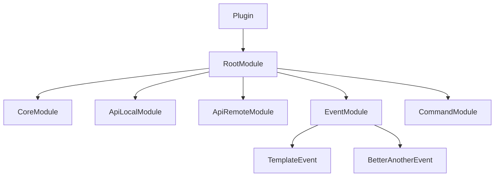

[](https://papermc.io)
[](https://files.minecraftforge.net)
[](https://neoforged.net)

# AstraTemplate

A production-grade Minecraft plugin/mod template written in Kotlin. Provides a modular, lifecycle-driven architecture that runs across Paper, Forge, and NeoForge from a single shared codebase.

---

## Plugins built on this template

<p>
  <a href="https://github.com/Astra-Interactive/AstraAuctions"></a>
  <a href="https://github.com/Astra-Interactive/AstraRating"></a>
  <a href="https://github.com/Astra-Interactive/AspeKt"></a>
  <a href="https://github.com/Astra-Interactive/AstraShop"></a>
  <a href="https://github.com/Astra-Interactive/SoulKeeper"></a>
</p>

---

## Project structure

```
AstraTemplate/
├── instances/
│   ├── bukkit/        ← Paper entry point + platform wiring
│   ├── forge/         ← Forge entry point + platform wiring
│   └── neoforge/      ← NeoForge entry point + platform wiring
└── modules/
    ├── api/
    │   ├── local/     ← Database (Exposed ORM, platform-agnostic)
    │   └── remote/    ← REST client (Ktor, platform-agnostic)
    ├── core/          ← Config, translations, coroutine scopes
    ├── build-konfig/  ← Compile-time constants (id, version, etc.)
    ├── feature-command/   ← All commands (platform-agnostic!)
    ├── feature-gui/
    │   ├── api/       ← GUI interfaces (Router, GuiModule)
    │   └── bukkit/    ← Bukkit chest-GUI implementation
    └── feature-event/
        ├── bukkit/    ← Bukkit event listeners
        ├── forge/     ← Forge event listeners
        └── neoforge/  ← NeoForge event listeners
```

Each `instances/<platform>` builds a fat jar via ShadowJar and is the only place that knows about a specific platform. Everything in `modules/` is either fully platform-agnostic or has a clearly named platform variant.

## Modules

<details>
<summary><b>modules/core</b> — config, translations, coroutine scopes</summary>

The foundation every other module depends on. Provides:

- **Config** — `PluginConfiguration` is a `@Serializable` data class written to `config.yml`. Reloaded on `/atempreload` via `StateFlowKrate`.
- **Translations** — `PluginTranslation` works the same way with `translation.yml`. Every string has a default value so the plugin works out of the box with no files present.
- **Coroutine scopes** — `ioScope`, `mainScope`, and `unconfinedScope` backed by `KotlinDispatchers` (platform-provided abstraction over `Dispatchers.IO` / main thread / etc.). All scopes are cancelled in `onDisable`.

</details>

<details>
<summary><b>modules/api/local</b> — local database via Exposed ORM</summary>

Local database access via [Jetbrains Exposed](https://github.com/JetBrains/Exposed) ORM. The `LocalDao` interface exposes suspend functions for CRUD operations on `UserTable` and `UserRatingTable`. The underlying database connection is derived reactively from the config flow, so switching from H2 to MySQL is a one-line config change and a reload.

Supported drivers (configured in `libs.versions.toml`): **H2**, **SQLite**, **MySQL**, **MariaDB**.

</details>

<details>
<summary><b>modules/api/remote</b> — REST API client via Ktor</summary>

REST API client built with [Ktor](https://ktor.io). Demonstrates fetching data from an external HTTP endpoint (the Rick & Morty API). The `RickMortyApi` interface returns `Result<T>` — errors are never thrown, always returned explicitly.

</details>

<details>
<summary><b>modules/build-konfig</b> — compile-time constants</summary>

Generates compile-time constants (`id`, `version`, etc.) via the BuildConfig Gradle plugin. Import from any module that needs to reference the plugin's identity at runtime without hardcoding strings.

</details>

<details>
<summary><b>modules/feature-command</b> — cross-platform commands (no platform imports)</summary>

All commands in one place, with **no platform imports**. Uses the Brigadier DSL from AstraLibs to define commands that compile and run identically on Paper, Forge, and NeoForge. The platform-specific `MultiplatformCommand` adapter is injected at the `RootModule` level.

</details>

<details>
<summary><b>modules/feature-gui</b> — chest GUI (Bukkit, with stub for other platforms)</summary>

Split into `api` (the `Router` interface + `GuiModule`) and `bukkit` (the implementation). The Bukkit implementation provides a paginated chest inventory driven by `StateFlow` — the GUI re-renders automatically whenever the underlying data changes. On Forge/NeoForge a `StubGuiModule` satisfies the interface so the shared command module compiles without pulling in Bukkit.

</details>

<details>
<summary><b>modules/feature-event</b> — platform-specific event listeners</summary>

Platform-specific event listeners, one submodule per platform. The Bukkit variant listens to `BlockPlaceEvent`; Forge and NeoForge variants listen to the server tick. Each submodule exposes a `Lifecycle` so `RootModule` can register and unregister listeners cleanly.

</details>

---

## Architecture

### Lifecycle tree

Every module exposes a `Lifecycle` with three callbacks: `onEnable`, `onDisable`, `onReload`. The plugin entry point creates a `RootModule`, chains all child lifecycles, and delegates to them:

```kotlin
// instances/bukkit — AstraTemplate.kt
class AstraTemplate : LifecyclePlugin() {
    private val rootModule = RootModule(this)

    override fun onEnable() = rootModule.lifecycle.onEnable()
    override fun onDisable() = rootModule.lifecycle.onDisable()
    override fun onReload() = rootModule.lifecycle.onReload()
}
```

```kotlin
// instances/bukkit — RootModule.kt
class RootModule(plugin: AstraTemplate) {
    val coreModule = CoreModule(plugin.dataFolder, DefaultBukkitDispatchers(plugin))
    val apiLocalModule = ApiLocalModule(coreModule.configKrate.cachedStateFlow, coreModule.ioScope)
    val apiRemoteModule = ApiRemoteModule()
    val eventModule = EventModule(coreModule, plugin)
    val guiModule = BukkitGuiModule(coreModule, apiLocalModule)
    val commandModule = CommandModule(coreModule, apiRemoteModule, guiModule, ...)

    val lifecycle = Lifecycle.Lambda(
        onEnable = { listOf(coreModule, eventModule, apiLocalModule, commandModule).forEach(Lifecycle::onEnable) },
        onDisable = { /* same list, reversed */ },
        onReload = { /* same list */ }
    )
}
```

This makes the plugin **reloadable at runtime** — `/atempreload` walks the same chain in reverse and re-enables it, picking up any config or translation changes on the fly.


```mermaid
graph TD
    Plugin --> RootModule
    RootModule --> CoreModule
    RootModule --> ApiLocalModule
    RootModule --> ApiRemoteModule
    RootModule --> EventModule
    RootModule --> CommandModule
    EventModule --> TemplateEvent
    EventModule --> BetterAnotherEvent
```

### Dependency injection

There is no DI framework. Each module is a plain class whose constructor receives other module interfaces it depends on. `RootModule` is the composition root and instantiates everything in the right order, using `lazy {}` where initialization must be deferred.

```kotlin
// Pass the whole module interface, not individual services extracted from it
val commandModule = CommandModule(
    coreModule = coreModule,
    guiModule = guiModule,
    apiRemoteModule = apiRemoteModule,
    ...
)
```

This keeps coupling explicit and avoids hidden runtime failures from missing bindings.

---

## Cross-platform commands

Commands live in `modules/feature-command` — a plain Kotlin module with **zero platform dependencies**. They use the Brigadier DSL from AstraLibs, which abstracts over Paper's and Forge's native Brigadier adapters.

```kotlin
// Works on Paper, Forge, and NeoForge without any changes
command("rickandmorty") {
    literal("random") {
        runs { ctx ->
            scope.launch(dispatchers.IO) {
                rmApi.getRandomCharacter(Random.nextInt(0, 100))
                    .onSuccess { ctx.getSender().sendMessage(...) }
                    .onFailure { ctx.getSender().sendMessage(...) }
            }
        }
    }
    literal("specific") {
        argument("number", IntegerArgumentType.integer()) { numberArg ->
            runs { ctx -> send(ctx.getSender(), ctx.requireArgument(numberArg)) }
        }
    }
}
```

On each platform the `RootModule` provides a `MultiplatformCommand` backed by the right adapter (`PaperMultiplatformCommands`, `MinecraftMultiplatformCommands`). The shared command code never needs to change.

### Available commands

| Command                             | Description                                          |
|-------------------------------------|------------------------------------------------------|
| `/add <player> <material> [amount]` | Add item to a player's inventory                     |
| `/translation`                      | Show current translation value (useful after reload) |
| `/adamage <player> <amount>`        | Deal damage to a player                              |
| `/atempgui`                         | Open the sample paginated GUI                        |
| `/rickandmorty random`              | Fetch a random Rick & Morty character via REST       |
| `/rickandmorty specific <id>`       | Fetch a specific character by id                     |
| `/atempreload`                      | Reload config, translations, and database connection |

---

## Configuration

Config and translations are plain `@Serializable` data classes serialized to YAML via [kaml](https://github.com/charleskorn/kaml). Inline doc-comments render directly in the generated YAML file:

```kotlin
@Serializable
data class PluginConfiguration(
    @YamlComment("First line description for config1", "Second line description for config2")
    @SerialName("config_1")
    val config1: String = "NONE",

    @SerialName("database")
    val database: DatabaseConfiguration = DatabaseConfiguration.H2("db")
)
```

Both config and translations are stored as `StateFlowKrate` / `CachedKrate`. Any module that reads them always sees the latest value after a reload — no manual propagation needed.

---

## Local database

`modules/api/local` uses [Jetbrains Exposed](https://github.com/JetBrains/Exposed) as the ORM. The database connection is derived reactively from the config flow — when the config is reloaded with a new database URL, the connection is replaced automatically:

```kotlin
private val databaseFlow = configFlow
    .map { it.database }
    .distinctUntilChanged()
    .flatMapLatest { configuration -> configuration.connectAsFlow() }
    .onEach { db ->
        transaction(db) { SchemaUtils.create(UserRatingTable, UserTable) }
    }
    .shareIn(ioScope, SharingStarted.Eagerly, 1)
```

Supported drivers (swap in `libs.versions.toml`): **H2**, **SQLite**, **MySQL**, **MariaDB**.

---

## Remote API

`modules/api/remote` shows how to call an external REST endpoint using Ktor. The interface is minimal:

```kotlin
interface RickMortyApi {
    suspend fun getRandomCharacter(id: Int): Result<RMResponse>
}
```

Errors are returned as `Result<T>` — never thrown — so callers handle failures explicitly.

---

## GUI (Bukkit)

The GUI layer sits behind a `Router` interface defined in `modules/feature-gui/api`. The Bukkit implementation provides a paginated chest inventory with reactive state via Kotlin `StateFlow`:

- `SampleGuiComponent` owns state (`Loading` / `Items` / `Users`)
- `SampleGUI` observes state and re-renders on every emission
- Navigation (next/prev page, change mode, add user, back/close) is handled by dedicated button objects

On Forge/NeoForge a `StubGuiModule` satisfies the `GuiModule` interface so the shared `CommandModule` compiles without a Bukkit dependency.

---

## Building

```bash
# Paper plugin
./gradlew :instances:bukkit:shadowJar

# Forge mod
./gradlew :instances:forge:shadowJar

# NeoForge mod
./gradlew :instances:neoforge:shadowJar

# Run all tests
./gradlew allTests
```

Output jars land in each instance's `build/libs/` directory and are optionally copied to a remote server by the FTP Gradle plugin (configure the destination in `libs.versions.toml`).

---

## Test server (Docker)

`docker-compose.yml` at the project root starts a local test server using [itzg/minecraft-server](https://github.com/itzg/docker-minecraft-server).

Before running, **manually edit `docker-compose.yml`** to uncomment the block for your target platform (Forge, NeoForge, or Paper) and comment out the others. Each block sets the `TYPE`, `VERSION`, and platform-specific version variables, and the matching `volumes` entry below it.

```bash
docker compose up
```
